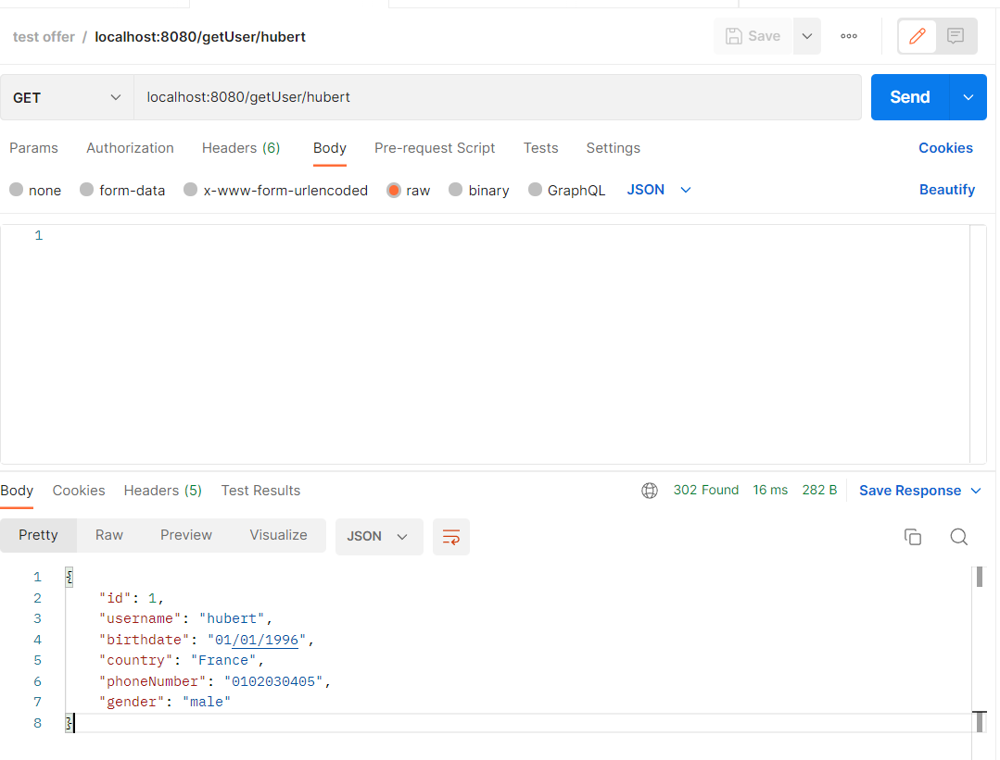
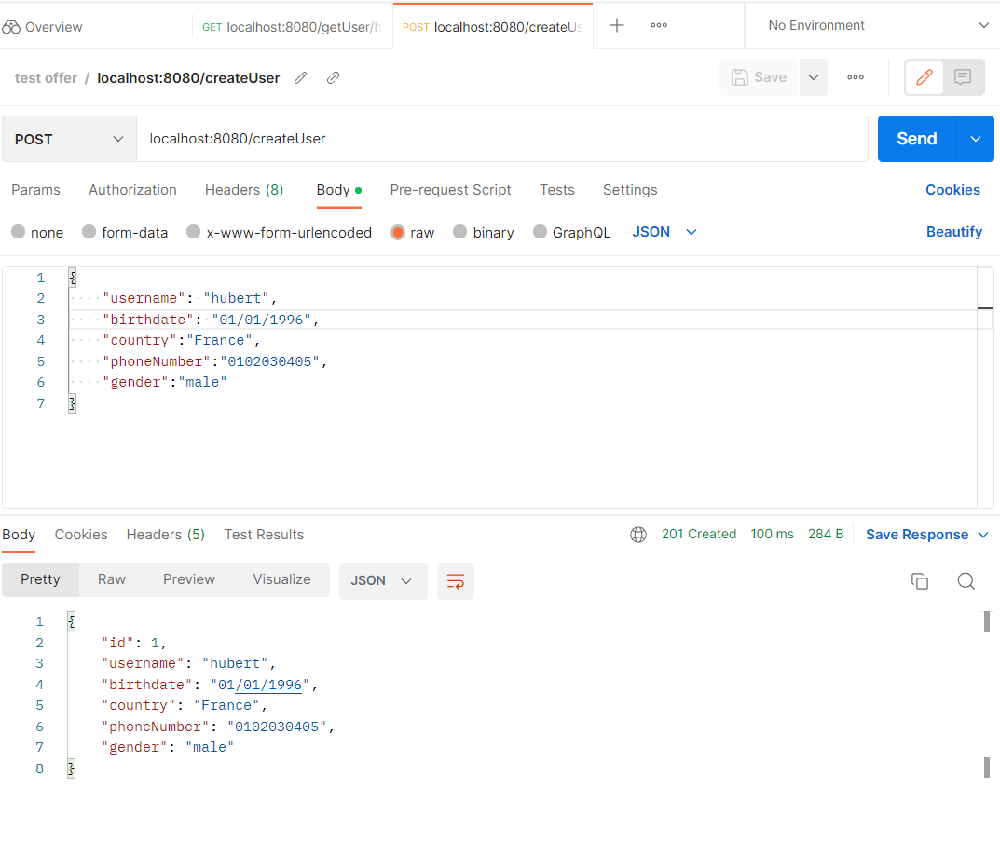

<!-- Improved compatibility of back to top link: See: https://github.com/othneildrew/Best-README-Template/pull/73 -->
<a name="readme-top"></a>
<!--
*** This readme is inspired from opensource Best readme template https://github.com/othneildrew/Best-README-Template/blob/master/BLANK_README.md-->

<!-- PROJECT SHIELDS -->
<!--
*** I'm using markdown "reference style" links for readability.
*** Reference links are enclosed in brackets [ ] instead of parentheses ( ).
*** See the bottom of this document for the declaration of the reference variables
*** for contributors-url, forks-url, etc. This is an optional, concise syntax you may use.
*** https://www.markdownguide.org/basic-syntax/#reference-style-links
-->


<!-- TABLE OF CONTENTS -->
<details>
  <summary>Table of Contents</summary>
  <ol>
    <li>
      <a href="#about-the-project">About The Project</a>
      <ul>
        <li><a href="#built-with">Built With</a></li>
      </ul>
    </li>
    <li>
      <a href="#getting-started">Getting Started</a>
      <ul>
        <li><a href="#prerequisites">Prerequisites</a></li>
        <li><a href="#installation">Installation</a></li>
      </ul>
    </li>
    <li><a href="#usage">Usage</a></li>
    <li><a href="#error-that-might-occur">Error that might occur</a></li>
  </ol>
</details>


<!-- ABOUT THE PROJECT -->
## About The Project

Here is an exemple of what the API does when using the display user service. : 




<p align="right">(<a href="#readme-top">back to top</a>)</p>


### Built With

<ul>
  <li>SpringBoot</li>
  <li>SpringData</li>
  <li>Hibernate</li>
  <li>Java</li>
</ul>

<p align="right">(<a href="#readme-top">back to top</a>)</p>


<!-- GETTING STARTED -->
## Getting Started

To set up your project I recommend you use the version 17 of Java(JDK17). Download it if you can.

If you can't use an older version I recommend you to launch the API using STS (Eclipse), since there can be some difficulty to build the executable using maven while using older versions of Java.

To get a local copy up and running follow these simple example steps.

### Prerequisites

Depending on how you want to launch the API you can download STS [https://spring.io/tools](https://spring.io/tools)

Download and install maven [https://maven.apache.org/download.cgi](https://maven.apache.org/download.cgi)

Download and install Java (JDK17>= if possible) [https://www.oracle.com/java/technologies/downloads/](https://www.oracle.com/java/technologies/downloads/)


### Installation
Using STS clone the git repository 

``` Download the zip of the project then unzip it where you want in your computer then open STS and import then general -> Existing project into Workspace....```

or

``` Copy the https link then open your IDE go to file then import -> git -> Projects from git and clone the project.```

To launch the API you can either launch it via STS as SpringBootApp.

Or

Using the terminal go to the project directory enter the directory (where the pom.xml file is) then use the command  ```mvn package``` , once the executable is built it should have been placed in the "target" directory. Use the command ```java -jar target/nameOfExecutable-Snapshot.jar```


<p align="right">(<a href="#readme-top">back to top</a>)</p>


<!-- USAGE EXAMPLES -->
## Usage

Once the API is launched use Postman (or similar software) to make your POST and GET requests (POST request uri : localhost:8080/createUser ; GET request uri : localhost:8080/getUser/$username)




(The API uses deffault error message if the request method is wrong or the url is wrong)
<p align="right">(<a href="#readme-top">back to top</a>)</p>

## Error that might occur

If you are building the jar executable using maven, an error might occur : 

```Unable to make field private maven com.sun.tools.javac.processing ....```

To correct this error look at the version of lombok in the pom.xml, it should be ```<lombok.version>1.18.20</lombok.version>``` (When doing maven clean, the version might automatically change to : 1.18.2)

<p align="right">(<a href="#readme-top">back to top</a>)</p>
